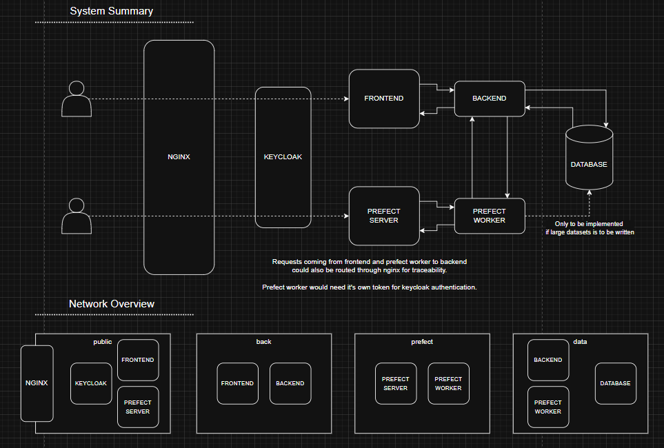

# devops-examples

To run any of the projects, launch a shell in their root folders, then use the docker compose commands.

## Example 1: Frontend depends on backend

Folder: [htmx-nginx](htmx-nginx)\
Explanation: [README.md](htmx-nginx/README.md)

## Example 2: Internal backend

Folder: [frontend-backend-compose](frontend-backend-compose)\
Explanation: [README.md](frontend-backend-compose/README.md)

## Example 3-4: Multiple networks, pages reachable from predefined urls

Folder: [simple-data-platform](simple-data-platform)\
Explanation: [README.md](simple-data-platform/README.md)
